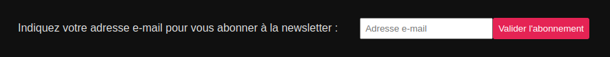
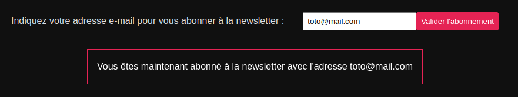
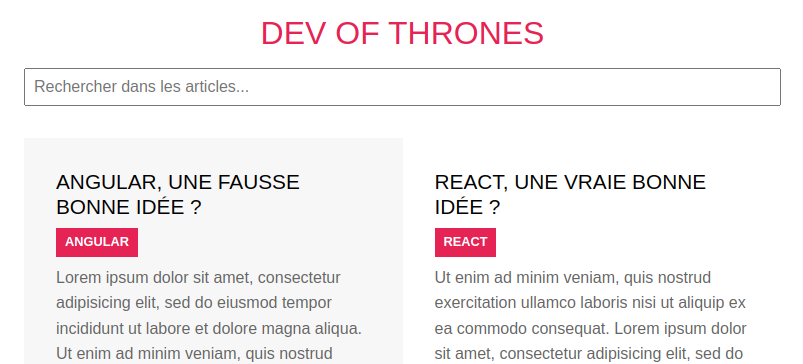
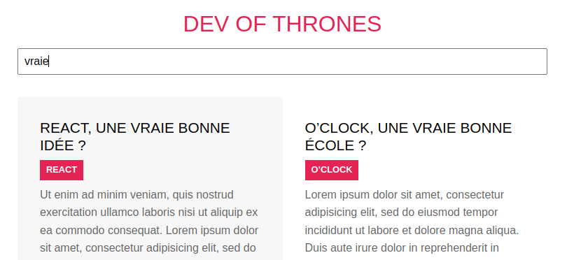

# Formulaires

Pour ce challenge on va travailler sur un blog. Ce blog est en cours de mise en place, il y a juste la page d'accueil pour le moment (pas de page pour chaque catégorie).

L'objectif sera d'ajouter un formulaire d'abonnement à la newsletter et un champ de recherche d'articles.

## 1 - Analyse du code

Commence par analyser le code déjà en place, regarde en particulier quels sont les différents composants. Tu trouveras peut-être des nouveautés dans le fonctionnement du "mode zen", prépare des questions pour la correction si besoin, ce "mode zen" n'a pas de lien avec ce qui est demandé dans le challenge. Il n'est pas nécessaire d'analyser en détail le code SCSS, c'est en option si c'est un sujet qui t'intéresse 💪.

Le dossier `/src/@types` permet de ranger des typages TS utilisés (ou utilisables) à plusieurs endroits, pour éviter de les copier/coller. On peut créer un fichier par type commun, ou alors un seul fichier qui regroupe tous les types communs, on appelle ce fichier `index.d.ts`. Il n'y aura pas besoin de manipuler ça pour le challenge.

## 2 - Formulaire d'abonnement à la newsletter

On voudrait avoir dans le `Footer` un formulaire d'abonnement à la newsletter, on saisit une adresse e-mail et on valide pour s'abonner.



Quand on a saisi une adresse e-mail et qu'on a cliqué sur le bouton : 




On affiche ce message de confirmation. Il n'y a pas d'envoi à un serveur pour un réel abonnement.

<details><summary>Si tu veux gagner du temps : proposition de code JSX/SCSS pour le formulaire</summary>

```js
  // Footer.tsx

  return (
    <footer className="copyright">
      DevOfThrones, le blog du développeur React - {year} ©
      <form className="newsletter">
        <label htmlFor="input-newsletter">
          Indiquez votre adresse e-mail pour vous abonner à la newsletter&nbsp;: 
          <input
            type="text"
            id="input-newsletter"
            placeholder="Adresse e-mail"
          />
        </label>
        <button type="submit">Valider l'abonnement</button>
      </form>
    </footer>
  );
```
  
```css
  /* Footer.scss */

  /* Ajouter le code suivant dans la classe `.copyright` */

  .newsletter {
    margin-top: vars.$gutter;

    #input-newsletter {
      margin-left: vars.$gutter;
      padding: 6px;
    }

    button {
      background-color: vars.$primary-color;
      border: none;
      color: vars.$light-color;
      padding: 8px;
      border-radius: 3px;
    }
  }
```

</details>


<details><summary>Si tu veux gagner du temps : proposition de code JSX/SCSS pour le message de confirmation</summary>

  
```html
<!-- Footer.tsx -->

<!-- Ajouter le code suivant dans la balise <footer> -->

<div className="confirm">
  Vous êtes maintenant abonné à la newsletter avec l'adresse toto@mail.com
</div>
```


```css
  /* Footer.scss */

  /* Ajouter le code suivant en haut du fichier */
  @use 'sass:math';
  /* CF: https://sass-lang.com/documentation/modules/math/ */
  /* Demonstration du module Sass qui permet de faire des opérations arithmétiques. Ici, on aurait pu utiliser un `calc()` CSS natif, mais une petite demonstration ne fait pas de mal */
  
  
  /* Ajouter le code suivant dans la classe `.copyright` */
  .confirm {
    display: inline-block;
    border: 1px solid vars.$primary-color;
    color: vars.$light-color;
    margin: vars.$gutter;
    padding: math.div(vars.$gutter, 2);
  }
```

</details>

<details><summary>Indices pour les étapes de mise en place</summary>

- réagir à la soumission du formulaire (avec un `console.log` de quelque chose pour vérifier)
- récupérer le contenu de l'input. On peut par exemple utiliser `new FormData(event.currentTarget)`.
  - penser à ajouter un attribut `email` sur l'`input` du formulaire, afin de pouvoir récupérer la donnée du formulaire avec le bon nom.
  - une fois la valeur récupérée, on peut avoir besoin faire comprendre à TypeScript qu'il s'agit bien d'une string. Pour cela, on peut utiliser `as string`.
- afficher le message de confirmation en utilisant le contenu de l'input
  - mise en place d'une variable de _state_ (car l'affichage devra changer), pour stocker l'adresse e-mail qui sera nécessaire pour construire le message de confirmation.
  - affichage conditionnel du message de confirmation
  - utiliser l'adresse e-mail du _state_ pour le message de confirmation
  - à la soumission du formulaire placer le contenu de l'input dans la variable de state

</details>

**Note** : On aurait envie de scroller automatiquement pour voir le message de confirmation : c'est possible avec React, mais pour ça il faut utiliser useEffect, qu'on verra bientôt 🤩

## 3 - Recherche dans les articles

On voudrait un champ de recherche qui permette de sélectionner uniquement les articles qui contiennent le texte indiqué. Le champ réagirait à chaque saisie de caractère, dès qu'on saisit un caractère les résultats sont mis à jour.






<details><summary>Si tu veux gagner du temps : proposition de code JSX/SCSS pour l'input</summary>
  
```html
<!-- Posts.tsx -->

<!-- Ajouter après la balise h1 -->


<input
  type="text"
  className="search"
  placeholder="Rechercher dans les articles..."
/>
```

```css
/* Posts.scss */

/* Ajouter à l'intérieur de la classe .posts */
.search {
  margin-bottom: vars.$gutter;
  font-size: 1em;
  padding: 0.5em;
  width: 100%;
}
```

</details>

<details><summary>Indices pour les étapes de mise en place</summary>

- 1 - on veut réagir à chaque caractère saisi, donc il nous faut un **champ contrôlé**.
   - 1.1 - mise en place d'une variable de state pour stocker la valeur de l'input => la fonctionnalité concerne uniquement le composant `Posts`, on peut donc placer la variable de state directement dans ce composant
   - 1.2 - utilisation des attributs `value` et `onChange` sur l'input pour faire le lien avec la variable de state

Vérification : on doit avoir dans le state le contenu de l'input, qui se met à jour dès qu'on saisit un caractère
- 2 - il faut filtrer les articles quand le champ est modifié
   - 2.1 - écrire un traitement de filtrage : on veut sélectionner uniquement les articles qui contiennent le texte saisi dans leur titre ou dans leur extrait. Tu peux écrire le traitement dans une fonction, ça te permettra de t'entraîner avec TypeScript pour les paramètres de fonction 💪
  
<details><summary>Proposition de solution pour la fonction</summary>

```ts
const filterPosts = (posts: IPost[], searchText: string) => {
  // si champ de recherche vide on retourne tous les articles
  if (searchText === '') {
    return posts;
  }

  // sélection des articles qui ont le texte indiqué dans leur titre ou dans leur extrait
  const searchTextLowered = searchText.toLowerCase();
  return posts.filter(
    (currentPost) =>
      currentPost.title.toLowerCase().includes(searchTextLowered) ||
      currentPost.excerpt.toLowerCase().includes(searchTextLowered),
  );
};
```

</details>

   - 2.2 utiliser ce traitement de filtrage : quand le contenu du champ est modifié ça provoque un nouveau rendu du composant `Posts`, on peut donc faire le filtrage dans ce composant, juste avant le `return`, et utiliser le résultat du filtrage pour le `map`.
  

</details>

## 4 - Surligner une catégorie si elle correspond au contenu du champ de recherche

_On pense à commit avant cette étape !_

Si l'utilisateur recherche un mot-clé qui est le nom d'une catégorie, on veut lui montrer qu'il y a cette catégorie qui pourrait l'intéresser.


Pour cela, il faut modifier ce qu'on a fait à l'étape 3, le composant `Posts` n'est plus le seul à avoir besoin de connaître le contenu du champ de recherche 😉 .

<details><summary>Indices pour les étapes de mise en place</summary>

- étudier quels composants ont besoin de la variable de state mise en place à l'étape 3, et déplacer cette variable de state dans le composant qui est l'ancêtre commun à ces composants. Adapter le code de `Posts` pour que le champ contrôlé fonctionne avec le nouvel emplacement de la variable de state

<details><summary>Aide</summary>

Les composants `Header` et `Posts` ont besoin de l'information => l'ancêtre commun est `App`. Il faut mettre en place des **props** sur le composant `Posts` pour qu'il puisse lire et modifier la variable de state qu'on a déplacée dans App.

</details>

- Faire en sorte que `Header` ait accès à la valeur de la variable de _state_ (il aura juste besoin de la lire, pas de la modifier)

<details><summary>Aide</summary>

Il faut mettre en place une **prop** sur le composant `Header`, permettant de fournir la valeur de la variable de state. On peut vérifier avec un `console.log` dans `Header` ou avec le React dev tool.

</details>

- Le composant `Header` doit attribuer une classe CSS supplémentaire à une catégorie si elle correspond au contenu du champ de recherche. Il faudra ensuite écrire le CSS pour que cette classe surligne en jaune.

<details><summary>Aide</summary>

Les catégories sont gérées par un `map`, il faut intégrer la classe CSS supplémentaire dans le `map`. On peut éventuellement :
- utiliser un ternaire (et avoir une ligne très longue et potentiellement pas très lisible 😅)
- ou alors on adapte la fonction fléchée pour qu'elle ait un `return` explicite (c'est-à-dire qu'on remet les accolades autour du corps de la fonction et le mot `return`), et on calcule la classe CSS à utiliser avec un `if`.

</details>


</details>
